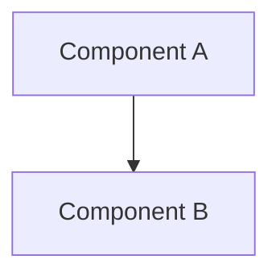

Execute the architecture diagram creation prompt at `.github/prompts/create-architecture-diagram.prompt.md` for: {{$1}}

This command generates an architecture diagram for a specification or component.

**Usage:**

```
/create-architecture docs/specifications/spec_user-auth.md
/create-architecture user-authentication
```

**What it does:**

1. Reads the specification file (or creates based on component name)
2. Identifies architectural components and their relationships
3. Creates diagram in THREE required formats:
   - **Text Description** - Bullet points, tables, or numbered lists
   - **ASCII Diagram** - Text-based visual using box-drawing characters
   - **Mermaid Diagram** - Collapsible Mermaid code block
4. Saves to `docs/diagrams/architecture_{name}.md`
5. Updates documentation indexes

**Diagram Format Requirements:**

All diagrams MUST include:

1. **Text Description**: Human-readable explanation
2. **ASCII Diagram**: Works everywhere, accessible, portable
3. **Mermaid Diagram**: Visual rendering in GitHub/IDEs

**ASCII Characters Available:**
```
┌ ─ ┐ │ └ ┘ ├ ┤ ┬ ┴ ┼ → ↓ ↑ ← ═ ║ ╔ ╗ ╚ ╝
```

**Output:**

- `docs/diagrams/architecture_{name}.md` with all three formats
- Updated `docs/INDEX.md`
- Updated `docs/SPEC-CROSS-REFERENCE.md`

**Diagram Types:**

- Component diagrams
- Sequence diagrams
- Data flow diagrams
- Deployment diagrams
- Class diagrams (if applicable)

**Example Output Structure:**

```markdown
# Architecture: {Name}

## Overview
{Brief description}

## Text Description
- Component A: {description}
- Component B: {description}
...

## ASCII Diagram
┌─────────────┐
│ Component A │
└──────┬──────┘
       │
       ↓
┌─────────────┐
│ Component B │
└─────────────┘

## Mermaid Diagram
<details>
<summary>Click to expand Mermaid diagram</summary>


</details>
```

**Next Steps:**

After creating architecture diagram, typically:
1. Review diagram for accuracy
2. Create threat model (if needed)
3. Proceed with implementation

**Note:** This command delegates to the tool-agnostic prompt at `.github/prompts/create-architecture-diagram.prompt.md`