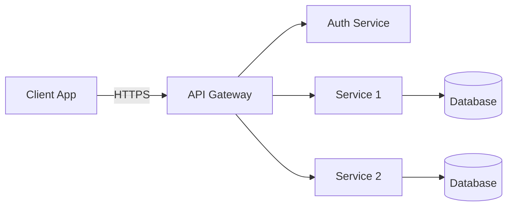
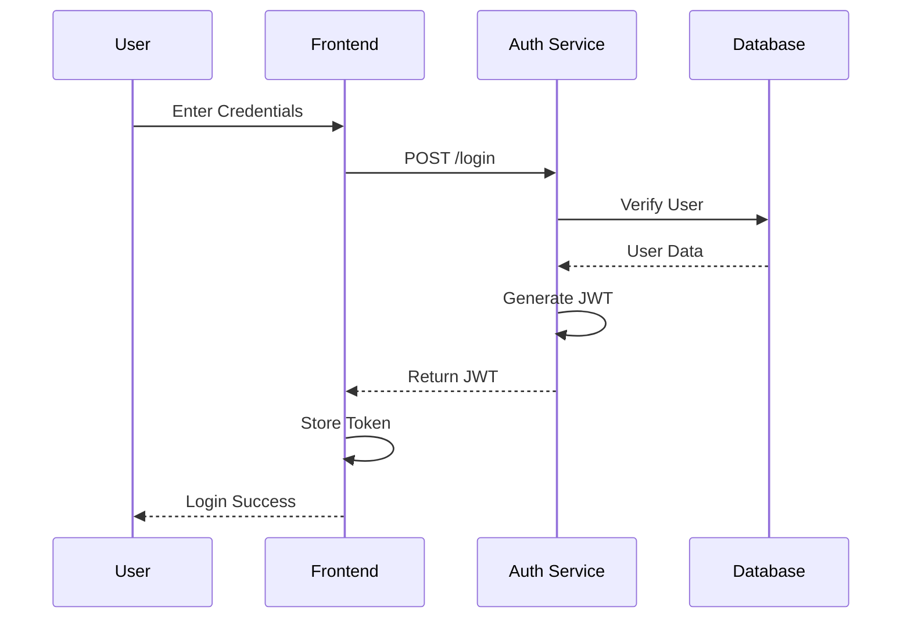
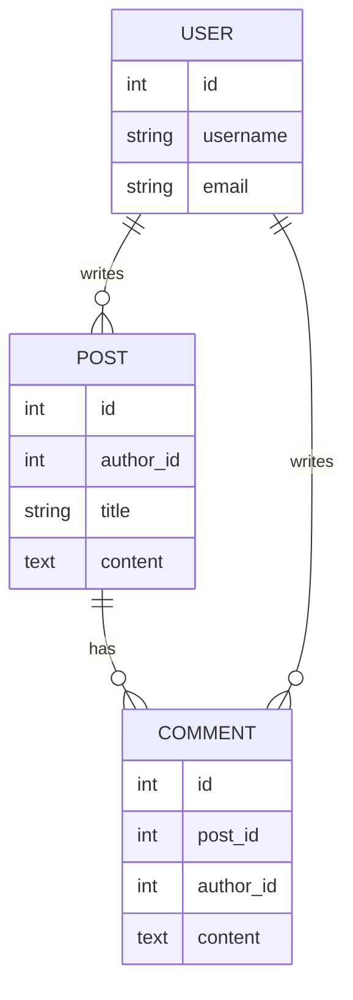

# Architecture Diagrams Instructions

**Last Updated**: 2025-11-09

This document provides guidance for creating architecture diagrams using Mermaid at the requirements stage of development.

## 🎯 Overview

Architecture diagrams visually communicate system design, component relationships, and data flow. Creating these diagrams early helps validate design decisions before implementation.

## 📋 Types of Architecture Diagrams

### System Architecture

High-level view of major components and their interactions

### Component Diagrams

Detailed view of individual components and their internal structure

### Sequence Diagrams

Show interactions over time between components

### Entity Relationship Diagrams (ERD)

Database schema and relationships

### Deployment Diagrams

How components are deployed across infrastructure

**TODO**: Add examples of each diagram type

## 🎨 Creating Diagrams with Mermaid

### Why Mermaid?

- **Text-based**: Version control friendly
- **Rendered in Markdown**: Works on GitHub, VSCode, etc.
- **No external tools**: Embedded directly in documentation
- **Maintainable**: Easy to update and diff

### Basic Mermaid Syntax

**TODO**: Add comprehensive Mermaid syntax guide

## 📐 Diagram Templates

### System Architecture Diagram

```markdown
# Architecture: {Feature Name}

**Requirement**: [REQ-XXX](../requirements/req-xxx.md)
**Specification**: [SPEC-XXX](../specifications/spec_xxx.md)
**Date**: YYYY-MM-DD
**Status**: Draft | Under Review | Approved

## Overview

[Describe the architecture and key design decisions]

## System Architecture

\`\`\`mermaid
graph TB
subgraph "Client Tier"
UI[User Interface]
end

    subgraph "Application Tier"
        API[API Server]
        Auth[Auth Service]
        BL[Business Logic]
    end

    subgraph "Data Tier"
        DB[(Database)]
        Cache[(Redis Cache)]
    end

    UI -->|HTTPS| API
    API --> Auth
    API --> BL
    BL --> DB
    BL --> Cache

\`\`\`

## Component Details

### API Server

- **Purpose**: Handle HTTP requests
- **Technology**: FastAPI / Flask / Django
- **Security**: See [codeguard-0-api-web-services.instructions.md](../codeguard-0-api-web-services.instructions.md)

[Add more components]

## Data Flow

\`\`\`mermaid
sequenceDiagram
participant User
participant API
participant Auth
participant DB

    User->>API: Request
    API->>Auth: Validate Token
    Auth-->>API: Token Valid
    API->>DB: Query Data
    DB-->>API: Return Data
    API-->>User: Response

\`\`\`

## References

- **Cross-Reference**: [SPEC-CROSS-REFERENCE.md](../SPEC-CROSS-REFERENCE.md)
- **Requirement**: [REQ-XXX](../requirements/req-xxx.md)
- **Threat Model**: [threat-model-{name}.md](threat-model-{name}.md)
```

**TODO**: Add more architecture diagram templates

### Sequence Diagram Template

```markdown
## Sequence: {Feature Name}

\`\`\`mermaid
sequenceDiagram
actor User
participant Frontend
participant Backend
participant Database

    User->>Frontend: Click Button
    Frontend->>Backend: POST /api/action
    Backend->>Database: INSERT data
    Database-->>Backend: Success
    Backend-->>Frontend: 200 OK
    Frontend-->>User: Show Success Message

\`\`\`
```

**TODO**: Add comprehensive sequence diagram examples

### Entity Relationship Diagram Template

```markdown
## Database Schema: {Feature Name}

\`\`\`mermaid
erDiagram
USER ||--o{ ORDER : places
USER {
int id PK
string email
string password_hash
datetime created_at
}
ORDER ||--|{ ORDER_ITEM : contains
ORDER {
int id PK
int user_id FK
datetime order_date
decimal total
}
ORDER_ITEM {
int id PK
int order_id FK
int product_id FK
int quantity
}
PRODUCT ||--o{ ORDER_ITEM : "ordered in"
PRODUCT {
int id PK
string name
decimal price
}
\`\`\`
```

**TODO**: Add ERD best practices and examples

### Component Diagram Template

```markdown
## Components: {Feature Name}

\`\`\`mermaid
graph LR
subgraph "Authentication Module"
Login[Login Handler]
JWT[JWT Manager]
Validator[Token Validator]
end

    subgraph "User Module"
        Profile[Profile Service]
        Settings[Settings Service]
    end

    Login --> JWT
    JWT --> Validator
    Profile --> Validator
    Settings --> Validator

\`\`\`
```

**TODO**: Add component diagram examples

## 📁 Output Location

Save architecture diagrams to `docs/diagrams/` with appropriate prefixes:

- System architecture: `architecture-{name}.md`
- Sequence diagrams: `sequence-{name}.md`
- ERD diagrams: `erd-{name}.md`
- Component diagrams: `component-{name}.md`
- Deployment diagrams: `deployment-{name}.md`

## ♻️ Diagram Versioning

**IMPORTANT**: When updating diagrams, create a duplicate file with the new changes rather than editing the original.

**Reasons:**

- Preserves history
- Better IDE compatibility (some IDEs don't render changes well)
- Avoids CLI-only edits that users might miss
- Easy rollback if needed

**Naming convention**:

```
architecture-{name}-v1.md
architecture-{name}-v2.md
architecture-{name}-v3.md
```

Or use dates:

```
architecture-{name}-2025-11-09.md
architecture-{name}-2025-12-15.md
```

**TODO**: Add versioning workflow and comparison guide

## 📝 Optional: Generate Separate .mmd Files

While Mermaid diagrams are embedded in Markdown, you can optionally export them to separate `.mmd` files for use with external tools.

**Example structure**:

```
docs/diagrams/
├── architecture-auth.md          # Markdown with embedded Mermaid
└── architecture-auth.mmd         # Separate Mermaid file (optional)
```

**TODO**: Add export script and usage guide

## 🔒 Security Considerations in Diagrams

When creating architecture diagrams, consider:

- Trust boundaries
- Authentication points
- Data encryption (in transit and at rest)
- API security
- Secret management

Reference relevant CodeGuard files:

- [codeguard-0-api-web-services.instructions.md](codeguard-0-api-web-services.instructions.md)
- [codeguard-0-authentication-mfa.instructions.md](codeguard-0-authentication-mfa.instructions.md)
- [codeguard-0-data-storage.instructions.md](codeguard-0-data-storage.instructions.md)

**TODO**: Add security annotation examples for diagrams

## 🎨 Diagram Format Requirements

**REQUIRED**: All architecture diagrams MUST include THREE formats:

1. **Text Description** - Human-readable bullet points, tables, or numbered lists
2. **ASCII Diagram** - Text-based visual diagram using box-drawing characters
3. **Mermaid Diagram** - Collapsible Mermaid code block

**Format Structure:**

```markdown
### Diagram Name

Brief summary sentence.

#### Text Description: [Name]

[Bullet points, tables, or numbered lists describing the diagram]

#### ASCII Diagram: [Name]

\`\`\`
[ASCII art diagram using ┌ ─ ┐ │ └ ┘ ├ ┤ ┬ ┴ ┼ → ↓ ↑ ← ═ etc.]
\`\`\`

#### Mermaid Diagram: [Name]

<details>
<summary>📊 View Mermaid Diagram Code</summary>

\`\`\`mermaid
[Mermaid code]
\`\`\`

</details>

#### Detailed Explanation

[Comprehensive explanation of the diagram]
```

**Why Three Formats?**
- **Accessibility**: Text descriptions for screen readers and those who can't view diagrams
- **Portability**: ASCII diagrams work in all text editors and terminals
- **Rendering**: Mermaid for visual rendering in supported environments
- **Redundancy**: Multiple formats ensure information is never lost

## 🤖 AI Assistant Integration

### For Claude Code

When generating architecture diagrams:

1. Reference requirement and specification documents
2. Use appropriate Mermaid diagram types
3. **ALWAYS include all three formats**: Text, ASCII, and Mermaid
4. Include security annotations
5. Link relevant CodeGuard files
6. Save to `docs/diagrams/` with proper prefix
7. Update cross-reference table
8. Create versioned copies for updates (not in-place edits)

**TODO**: Add Claude-specific examples and prompts

### For GitHub Copilot

**TODO**: Add Copilot-specific examples

## ✅ Diagram Quality Checklist

- [ ] Diagram type appropriate for purpose
- [ ] All major components included
- [ ] Relationships clearly shown
- [ ] Security boundaries marked
- [ ] CodeGuard files referenced where relevant
- [ ] Linked to requirement/specification
- [ ] Proper file naming convention used
- [ ] Added to cross-reference table
- [ ] Rendered correctly in Markdown viewer

**TODO**: Expand checklist with specific criteria

## 📚 Mermaid Diagram Gallery

### Example: Simple API Architecture

This example demonstrates a basic microservices architecture with an API gateway fronting multiple backend services.

#### Text Description: API Architecture

**Client-to-Services Flow:**
- **Client App** connects to **API Gateway** via HTTPS
- **API Gateway** routes requests to:
  - **Auth Service** (authentication and authorization)
  - **Service 1** (connects to Database 1)
  - **Service 2** (connects to Database 2)

**Data Layer:**
- Service 1 → Database 1
- Service 2 → Database 2

#### Mermaid Diagram: API Architecture

<details>
<summary>📊 View Mermaid Diagram Code</summary>



</details>

#### ASCII Diagram: API Architecture

```
                                         ┌──────────────────┐
                                         │   Auth Service   │
                                         └──────────────────┘
                                                 ↑
                                                 │
┌──────────────┐       HTTPS        ┌────────────┴─────────┐
│  Client App  │ ═════════════════> │    API Gateway       │
└──────────────┘                    └────────────┬─────────┘
                                                 │
                                   ┌─────────────┼─────────────┐
                                   │             │             │
                                   ↓             ↓             ↓
                           ┌──────────────┐ ┌──────────────┐  ...
                           │  Service 1   │ │  Service 2   │
                           └──────┬───────┘ └──────┬───────┘
                                  │                │
                                  ↓                ↓
                           ┌──────────────┐ ┌──────────────┐
                           │ ┌──────────┐ │ │ ┌──────────┐ │
                           │ │Database 1│ │ │ │Database 2│ │
                           │ └──────────┘ │ │ └──────────┘ │
                           └──────────────┘ └──────────────┘
```

#### Detailed Explanation

This architecture follows a common microservices pattern:
- **API Gateway**: Single entry point for all client requests, handles routing, rate limiting, and protocol translation
- **Auth Service**: Centralized authentication service that validates tokens and manages user sessions
- **Service 1 & 2**: Independent backend services with their own databases (database-per-service pattern)
- **HTTPS**: Encrypted communication between client and gateway for security
- **Separation of concerns**: Each service has its own database, enabling independent scaling and deployment

### Example: Authentication Flow

This sequence diagram illustrates a typical JWT-based authentication flow from login to token storage.

#### Text Description: Authentication Flow

1. **User** enters credentials into the **Frontend**
2. **Frontend** sends POST request to **Auth Service** (`POST /login`)
3. **Auth Service** queries **Database** to verify user credentials
4. **Database** returns user data to **Auth Service**
5. **Auth Service** generates a JWT token
6. **Auth Service** returns JWT to **Frontend**
7. **Frontend** stores the token (typically in secure storage)
8. **Frontend** displays login success message to **User**

#### Mermaid Diagram: Authentication Flow

<details>
<summary>📊 View Mermaid Diagram Code</summary>



</details>

#### ASCII Diagram: Authentication Flow

```
┌──────┐          ┌──────────┐        ┌──────────────┐      ┌──────────┐
│ User │          │ Frontend │        │ Auth Service │      │ Database │
└──┬───┘          └────┬─────┘        └──────┬───────┘      └────┬─────┘
   │                   │                     │                   │
   │ Enter Credentials │                     │                   │
   │──────────────────>│                     │                   │
   │                   │                     │                   │
   │                   │  POST /login        │                   │
   │                   │────────────────────>│                   │
   │                   │                     │                   │
   │                   │                     │  Verify User      │
   │                   │                     │──────────────────>│
   │                   │                     │                   │
   │                   │                     │  User Data        │
   │                   │                     │<──────────────────│
   │                   │                     │                   │
   │                   │                     │ Generate JWT      │
   │                   │                     │──────┐            │
   │                   │                     │      │            │
   │                   │                     │<─────┘            │
   │                   │                     │                   │
   │                   │  Return JWT         │                   │
   │                   │<────────────────────│                   │
   │                   │                     │                   │
   │                   │ Store Token         │                   │
   │                   │──────┐              │                   │
   │                   │      │              │                   │
   │                   │<─────┘              │                   │
   │                   │                     │                   │
   │  Login Success    │                     │                   │
   │<──────────────────│                     │                   │
   │                   │                     │                   │
```

#### Detailed Explanation

This authentication flow demonstrates secure credential verification:
- **Credential submission**: User submits username/password through the frontend
- **API request**: Frontend sends credentials via secure POST to the authentication service
- **Database verification**: Auth service queries database to verify credentials (password should be hashed)
- **Token generation**: Upon successful verification, a JWT token is generated with user claims
- **Token delivery**: JWT is returned to frontend for subsequent authenticated requests
- **Secure storage**: Frontend stores token securely (httpOnly cookie or secure localStorage)
- **User feedback**: User receives confirmation of successful login

**Security considerations**: Passwords should never be sent in plain text (use HTTPS), stored passwords must be hashed with bcrypt or similar, and tokens should have appropriate expiration times.

### Example: Database Schema

This ERD example shows a simple blog platform with users, posts, and comments.

#### Text Description: Database Schema

**Entities and Relationships:**

| Entity | Relationship | Related Entity | Cardinality |
|--------|-------------|---------------|-------------|
| USER | writes | POST | One-to-Many (one user can write many posts) |
| USER | writes | COMMENT | One-to-Many (one user can write many comments) |
| POST | has | COMMENT | One-to-Many (one post can have many comments) |

**Entity Attributes:**

**USER Entity:**
- `id` (int) - Primary key
- `username` (string) - User's display name
- `email` (string) - User's email address

**POST Entity:**
- `id` (int) - Primary key
- `author_id` (int) - Foreign key to USER
- `title` (string) - Post title
- `content` (text) - Post body content

**COMMENT Entity:**
- `id` (int) - Primary key
- `post_id` (int) - Foreign key to POST
- `author_id` (int) - Foreign key to USER
- `content` (text) - Comment content

#### Mermaid Diagram: Database Schema

<details>
<summary>📊 View Mermaid Diagram Code</summary>



</details>

#### ASCII Diagram: Database Schema

```
┌──────────────────┐                      ┌──────────────────┐
│      USER        │                      │      POST        │
├──────────────────┤                      ├──────────────────┤
│ PK: id (int)     │                      │ PK: id (int)     │
│     username     │──────── writes ─────>│ FK: author_id    │
│     email        │        (1:N)         │     title        │
└────────┬─────────┘                      │     content      │
         │                                └────────┬─────────┘
         │                                         │
         │                                         │
         │                                        has
         │                                       (1:N)
         │                                         │
         │                                         ↓
         │                                ┌──────────────────┐
         │                                │     COMMENT      │
         │                                ├──────────────────┤
         │                                │ PK: id (int)     │
         └─────────── writes ────────────>│ FK: post_id      │
                      (1:N)               │ FK: author_id    │
                                          │     content      │
                                          └──────────────────┘
```

#### Detailed Explanation

This database schema illustrates a typical blog platform design:
- **USER entity**: Stores user account information with unique identifier, username, and email
- **POST entity**: Contains blog posts authored by users, with foreign key relationship to USER table
- **COMMENT entity**: Stores comments on posts, with foreign keys to both POST (which post) and USER (who commented)
- **Relationships**:
  - One user can write multiple posts (1:N)
  - One user can write multiple comments (1:N)
  - One post can have multiple comments (1:N)
- **Referential integrity**: Foreign keys ensure comments reference valid posts and users
- **Cardinality notation**: `||--o{` means "one-to-many" (one on left, zero or more on right)

**TODO**: Add more comprehensive diagram examples

## 📖 Mermaid Syntax Quick Reference

### Graph Directions

- `LR`: Left to Right
- `TB`: Top to Bottom
- `RL`: Right to Left
- `BT`: Bottom to Top

### Node Shapes

- `[Rectangle]`: `Node[Text]`
- `(Rounded)`: `Node(Text)`
- `{Diamond}`: `Node{Text}`
- `((Circle))`: `Node((Text))`
- `[(Database)]`: `Node[(Text)]`

### Connection Types

- `-->`: Solid arrow
- `-.->`: Dotted arrow
- `==>`: Thick arrow
- `--text-->`: Arrow with text

**TODO**: Add complete Mermaid syntax reference

## 🔗 Related Documentation

- [Master Workflow](master-workflow.md)
- [Threat Modeling](threat-modeling.instructions.md)
- [Requirements Template](../../docs/templates/requirements-template.md)
- [Specification Template](../../docs/templates/spec-template.md)

## 🌐 External Resources

- [Mermaid Official Documentation](https://mermaid.js.org/)
- [Mermaid Live Editor](https://mermaid.live/)
- [C4 Model for Architecture](https://c4model.com/)

---

**TODO**: This is a placeholder. Expand with:

- Complete Mermaid syntax guide
- Comprehensive diagram examples for common patterns
- Automation scripts for diagram generation
- Best practices for diagram maintenance
- Integration with documentation site (mkdocs)
