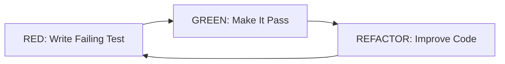

# Test-Driven Development (TDD) Workflow

**Last Updated**: 2025-11-09

This document outlines the Test-Driven Development workflow using the RED-GREEN-REFACTOR cycle.

## 🎯 TDD Principles

Test-Driven Development follows a simple but powerful cycle:

### The TDD Cycle

The TDD cycle is a continuous loop of three phases that ensures code quality through iterative testing and refinement.

#### Text Description: TDD Cycle

The TDD workflow follows a repeating three-step cycle:

1. **🔴 RED** - Write a failing test that defines the desired behavior
2. **🟢 GREEN** - Write minimal code to make the test pass
3. **🔵 REFACTOR** - Improve the code while keeping tests passing

After refactoring, return to step 1 for the next feature or improvement.

#### Mermaid Diagram: TDD Cycle

<details>
<summary>📊 View Mermaid Diagram Code</summary>



</details>

#### ASCII Diagram: TDD Cycle

```
                    ┌─────────────────────────────────┐
                    │                                 │
                    ↓                                 │
          ┌──────────────────────┐                    │
          │   🔴 RED PHASE       │                   │
          │  Write Failing Test  │                    │
          └──────────────────────┘                    │
                    │                                 │
                    ↓                                 │
          ┌──────────────────────┐                    │
          │  🟢 GREEN PHASE      │                   │
          │  Make Test Pass      │                    │
          └──────────────────────┘                    │
                    │                                 │
                    ↓                                 │
          ┌──────────────────────┐                    │
          │  🔵 REFACTOR PHASE   │                   │
          │  Improve Code        │                    │
          └──────────────────────┘                    │
                    │                                 │
                    └─────────────────────────────────┘
                           (Repeat for next feature)
```

#### Detailed Explanation

The TDD cycle is circular and continuous:
- **RED phase**: Before writing any implementation, write a test that fails because the functionality doesn't exist yet
- **GREEN phase**: Write just enough production code to make the test pass - no more, no less
- **REFACTOR phase**: With passing tests as a safety net, improve code quality through better naming, removing duplication, and enhancing design
- **Loop back**: Once refactoring is complete, start the cycle again for the next piece of functionality

This cycle ensures that every line of code is covered by tests and that the codebase continuously improves.

### Why TDD?

- **Better Design**: Writing tests first leads to more testable, modular code
- **Confidence**: Comprehensive tests give confidence to refactor
- **Documentation**: Tests serve as executable documentation
- **Fewer Bugs**: Catch issues early in development

## 📋 The RED-GREEN-REFACTOR Cycle

### 🔴 RED: Write a Failing Test

**Before writing any implementation code**, write a test that:
1. Clearly defines the expected behavior
2. Fails because the feature doesn't exist yet
3. Fails for the right reason (not syntax errors)

**Example:**

```python
# test/test_calculator.py
import pytest
from src.calculator import add

def test_add_two_numbers():
    """Test that add() correctly sums two numbers."""
    result = add(2, 3)
    assert result == 5
```

Run the test - it should **FAIL** (red):
```bash
pytest test/test_calculator.py::test_add_two_numbers -v
```

**Examples for different test types:**

**Unit Test (testing a single function):**
```python
def test_validate_email_with_valid_input():
    """Test email validation with a valid email address."""
    result = validate_email("user@example.com")
    assert result is True
```

**Integration Test (testing multiple components):**
```python
def test_user_registration_flow():
    """Test complete user registration including validation and database storage."""
    user_data = {"email": "test@example.com", "password": "secure123"}
    user_id = register_user(user_data)
    stored_user = get_user(user_id)
    assert stored_user["email"] == user_data["email"]
```

**Edge Case Test (boundary conditions):**
```python
def test_add_with_zero():
    """Test addition with zero as one operand."""
    assert add(5, 0) == 5
    assert add(0, 5) == 5
    assert add(0, 0) == 0
```

**Error Condition Test:**
```python
def test_divide_by_zero_raises_error():
    """Test that division by zero raises ValueError."""
    with pytest.raises(ValueError, match="Cannot divide by zero"):
        divide(10, 0)
```

### 🟢 GREEN: Write Minimal Code to Pass

Write **just enough code** to make the test pass. Don't over-engineer.

**Example:**

```python
# src/calculator.py
def add(a, b):
    """Add two numbers and return the result."""
    return a + b
```

Run the test - it should **PASS** (green):
```bash
pytest test/test_calculator.py::test_add_two_numbers -v
```

**Examples of Minimal vs Over-Engineering:**

**✅ GOOD - Minimal Implementation:**
```python
def get_user_by_id(user_id):
    """Get user from database by ID."""
    return database.query("SELECT * FROM users WHERE id = ?", user_id)
```

**❌ BAD - Over-Engineering (premature optimization):**
```python
class UserRepository:
    """Complex repository pattern with caching and connection pooling."""
    def __init__(self):
        self._cache = LRUCache(maxsize=1000)
        self._connection_pool = ConnectionPool(size=10)

    def get_user_by_id(self, user_id):
        # Check cache first
        if user_id in self._cache:
            return self._cache[user_id]

        # Get from database with connection pooling
        with self._connection_pool.get_connection() as conn:
            user = conn.query("SELECT * FROM users WHERE id = ?", user_id)
            self._cache[user_id] = user
            return user
```

**Why minimal is better in GREEN phase:**
- Faster to implement
- Easier to understand
- Can add optimization later if needed (during REFACTOR or future cycles)
- Test will tell you if you need more complexity

### 🔵 REFACTOR: Improve the Code

Now that the test passes, improve the code while keeping tests green:
- Remove duplication
- Improve naming
- Enhance readability
- Optimize if needed

**Example:**

```python
# src/calculator.py
def add(a: float, b: float) -> float:
    """
    Add two numbers and return the result.

    Args:
        a: First number to add
        b: Second number to add

    Returns:
        Sum of a and b

    Examples:
        >>> add(2, 3)
        5
        >>> add(-1, 1)
        0
    """
    return a + b
```

Run tests again - should still **PASS**:
```bash
pytest test/test_calculator.py -v
```

**Repeat the cycle** for the next feature or behavior.

**Refactoring Patterns and Best Practices:**

**1. Extract Function (Remove Duplication)**
```python
# Before refactoring
def process_user_data(user):
    name = user['first_name'] + ' ' + user['last_name']
    # ... use name

def display_user(user):
    name = user['first_name'] + ' ' + user['last_name']
    # ... use name

# After refactoring
def get_full_name(user):
    """Get user's full name."""
    return f"{user['first_name']} {user['last_name']}"

def process_user_data(user):
    name = get_full_name(user)
    # ... use name

def display_user(user):
    name = get_full_name(user)
    # ... use name
```

**2. Improve Naming**
```python
# Before
def calc(x, y, z):
    return (x * y) / z

# After
def calculate_price_per_unit(total_price, quantity, tax_rate):
    """Calculate price per unit including tax."""
    return (total_price * tax_rate) / quantity
```

**3. Add Type Hints and Docstrings**
```python
# Before
def process(data):
    return data.strip().lower()

# After
def normalize_text(text: str) -> str:
    """
    Normalize text by stripping whitespace and converting to lowercase.

    Args:
        text: Input text to normalize

    Returns:
        Normalized text with no leading/trailing whitespace and all lowercase

    Examples:
        >>> normalize_text("  Hello World  ")
        'hello world'
    """
    return text.strip().lower()
```

**4. Defensive Coding (Add Validation)**
```python
# Before
def divide(a, b):
    return a / b

# After
def divide(a: float, b: float) -> float:
    """
    Divide two numbers safely.

    Args:
        a: Dividend
        b: Divisor

    Returns:
        Result of a divided by b

    Raises:
        ValueError: If divisor is zero
        TypeError: If arguments are not numbers
    """
    if not isinstance(a, (int, float)) or not isinstance(b, (int, float)):
        raise TypeError(f"Arguments must be numbers, got {type(a).__name__} and {type(b).__name__}")
    if b == 0:
        raise ValueError("Cannot divide by zero")
    return a / b
```

## 🏗️ Test Structure Standards

### Directory Structure

Tests should **mirror** the `src/` directory structure:

```
src/
├── calculator.py
├── auth/
│   ├── login.py
│   └── logout.py
└── utils/
    └── validator.py

test/
├── test_calculator.py
├── test_auth/
│   ├── test_login.py
│   └── test_logout.py
└── test_utils/
    └── test_validator.py
```

### File Naming Convention

- Test files: `test_{module_name}.py`
- Test functions: `test_{behavior}_description`
- Test classes: `Test{ClassName}`

**TODO**: Add examples of good vs bad test names

### Test Organization

```python
# test/test_example.py

import pytest
from src.example import ExampleClass

class TestExampleClass:
    """Tests for ExampleClass."""

    def test_initialization(self):
        """Test that ExampleClass initializes correctly."""
        # TODO: Add AAA pattern example (Arrange, Act, Assert)
        pass

    def test_method_with_valid_input(self):
        """Test method behavior with valid input."""
        pass

    def test_method_with_invalid_input(self):
        """Test method behavior with invalid input."""
        pass

    @pytest.mark.parametrize("input,expected", [
        (1, 2),
        (2, 4),
        (3, 6),
    ])
    def test_method_with_multiple_inputs(self, input, expected):
        """Test method with parametrized inputs."""
        pass
```

**TODO**: Add comprehensive test organization patterns

## 🔒 Security Testing Integration - Shift-Left Approach

**Security is not a phase - it's a continuous practice embedded in each TDD cycle.**

### Shift-Left Security TDD Workflow

```
🔴 RED Phase:
  1. Write functional test (standard behavior)
  2. Verify it fails for the right reason
  3. Add security-specific tests BEFORE implementing
  4. Verify security tests also fail

🟢 GREEN Phase:
  Write code that passes BOTH functional AND security tests
  Use secure coding practices from the start

🔵 REFACTOR Phase:
  Improve code while maintaining ALL tests (functional + security)
  Never sacrifice security for elegance
```

### Example: Secure Email Validation Function

#### Step 1: 🔴 RED - Functional Test First

```python
# test/test_validator.py
import pytest
from src.validator import validate_email

def test_validate_email_with_valid_input():
    """Test email validation accepts valid emails."""
    assert validate_email("user@example.com") is True
    assert validate_email("test.user+tag@domain.co.uk") is True
```

Run test → ❌ FAILS (function doesn't exist) ✓ Correct failure

#### Step 2: 🔴 RED - Add Security Tests BEFORE Implementation

```python
# test/test_validator.py (continued)

def test_validate_email_input_validation():
    """
    Test email validation with boundary conditions and type validation.

    Security: Input validation prevents unexpected behavior.
    References:
        - .github/instructions/codeguard-0-input-validation-injection.instructions.md
    """
    # Type validation
    assert validate_email(None) is False
    assert validate_email(123) is False
    assert validate_email([]) is False

    # Boundary conditions
    assert validate_email("") is False
    assert validate_email("   ") is False
    assert validate_email("a" * 255 + "@example.com") is False  # Too long

    # Format validation
    assert validate_email("notanemail") is False
    assert validate_email("@example.com") is False
    assert validate_email("user@") is False

def test_validate_email_injection_prevention():
    """
    Test email validation prevents injection attacks.

    Security: Prevent XSS and command injection via email field.
    """
    # XSS payloads
    assert validate_email("<script>alert('xss')</script>@example.com") is False
    assert validate_email("user@example.com<script>") is False

    # Command injection attempts
    assert validate_email("user@example.com; rm -rf /") is False
    assert validate_email("user@example.com`whoami`") is False

    # Path traversal
    assert validate_email("../../../etc/passwd@example.com") is False

    # SQL injection patterns
    assert validate_email("admin'--@example.com") is False
```

Run tests → ❌ ALL FAIL (function doesn't exist) ✓ Ready for implementation

#### Step 3: 🟢 GREEN - Implement with Secure Coding Practices

```python
# src/validator.py
import re
from typing import Any

# Whitelist validation pattern (OWASP recommended)
EMAIL_PATTERN = re.compile(
    r'^[a-zA-Z0-9._%+-]+@[a-zA-Z0-9.-]+\.[a-zA-Z]{2,}$'
)

def validate_email(email: Any) -> bool:
    """
    Validate email address using whitelist validation.

    Security practices applied:
    - Type validation (fail securely)
    - Whitelist validation (not blacklist)
    - Length limits (prevent DoS)
    - No dangerous characters allowed

    Args:
        email: Email address to validate (accepts Any for type checking)

    Returns:
        True if valid, False otherwise (fail securely)

    References:
        - .github/instructions/codeguard-0-input-validation-injection.instructions.md
    """
    # Type validation - fail securely
    if not isinstance(email, str):
        return False

    # Whitespace handling
    email = email.strip()

    # Length validation (prevent DoS, typical max is 254)
    if len(email) == 0 or len(email) > 254:
        return False

    # Whitelist validation (ONLY allow safe characters)
    if not EMAIL_PATTERN.match(email):
        return False

    return True
```

Run tests → ✅ ALL PASS (functional + security)

#### Step 4: 🔵 REFACTOR - Maintain Security

```python
# src/validator.py (refactored)
import re
from typing import Any

EMAIL_PATTERN = re.compile(
    r'^[a-zA-Z0-9._%+-]+@[a-zA-Z0-9.-]+\.[a-zA-Z]{2,}$'
)
MAX_EMAIL_LENGTH = 254  # RFC 5321

def validate_email(email: Any) -> bool:
    """
    Validate email address using whitelist validation.

    Security: Defense in depth with multiple validation layers.

    Args:
        email: Email address to validate

    Returns:
        True if valid email, False otherwise (fail securely)

    Raises:
        Never raises - fails securely by returning False
    """
    # Layer 1: Type validation
    if not isinstance(email, str):
        return False

    # Layer 2: Sanitization
    email = email.strip()

    # Layer 3: Length validation
    if not (0 < len(email) <= MAX_EMAIL_LENGTH):
        return False

    # Layer 4: Whitelist pattern validation
    return bool(EMAIL_PATTERN.match(email))
```

Run tests → ✅ ALL PASS (security maintained during refactor)

### Security Principles in TDD

**1. Fail Securely**
```python
# ❌ BAD: Fails open (insecure default)
def check_permission(user, resource):
    try:
        return user.has_permission(resource)
    except:
        return True  # Grants access on error!

# ✅ GOOD: Fails closed (secure default)
def check_permission(user, resource):
    try:
        return user.has_permission(resource)
    except:
        return False  # Denies access on error
```

**2. Defense in Depth (Multiple Security Layers)**
```python
def process_user_input(data: str) -> str:
    """Multiple validation layers."""
    # Layer 1: Type check
    if not isinstance(data, str):
        raise TypeError("String required")

    # Layer 2: Length limit
    if len(data) > 1000:
        raise ValueError("Input too long")

    # Layer 3: Whitelist validation
    if not re.match(r'^[a-zA-Z0-9\s]+$', data):
        raise ValueError("Invalid characters")

    # Layer 4: Sanitization
    return data.strip()
```

**3. Principle of Least Privilege**
```python
# Test
def test_user_can_only_access_own_data():
    """Users should only access their own resources."""
    user1 = User(id=1)
    user2 = User(id=2)

    # User 1 accessing their own data: OK
    assert get_user_data(user_id=1, current_user=user1) is not None

    # User 1 accessing user 2's data: DENIED
    with pytest.raises(PermissionError):
        get_user_data(user_id=2, current_user=user1)
```

**4. Use Established Security Libraries**
```python
# ❌ BAD: Rolling your own crypto
def hash_password(password):
    return hashlib.md5(password.encode()).hexdigest()

# ✅ GOOD: Using established library
import bcrypt

def hash_password(password: str) -> str:
    """Use bcrypt (industry standard)."""
    salt = bcrypt.gensalt(rounds=12)
    return bcrypt.hashpw(password.encode(), salt).decode()
```

**5. Parameterized Queries (Injection Prevention)**
```python
# ❌ BAD: String concatenation (SQL injection risk)
def get_user(email):
    query = f"SELECT * FROM users WHERE email = '{email}'"
    return db.execute(query)

# ✅ GOOD: Parameterized query
def get_user(email: str):
    """Prevent SQL injection with parameterization."""
    query = "SELECT * FROM users WHERE email = ?"
    return db.execute(query, (email,))
```

### Continuous Security Integration

**In CI/CD Pipeline:**
```yaml
# .github/workflows/security.yml
- name: Security Linting
  run: |
    bandit -r src/
    safety check

- name: Security Test Coverage
  run: |
    pytest --cov=src --cov-report=term tests/security/
```

**Per-Feature Threat Modeling:**
- Identify security requirements during planning
- Document threats in specification
- Reference threat model in security tests
- Track mitigation implementation

**Security Test Coverage Metrics:**
- Track ratio of security tests to total tests
- Ensure security-sensitive functions have 100% coverage
- Monitor security test failure trends

## ✅ Test Quality Checklist

- [ ] Tests are written **before** implementation code
- [ ] Each test tests **one behavior**
- [ ] Tests have **clear, descriptive names**
- [ ] Tests follow **AAA pattern** (Arrange, Act, Assert)
- [ ] Edge cases are covered
- [ ] Error conditions are tested
- [ ] Security considerations are tested (where applicable)
- [ ] Tests are **independent** (no shared state)
- [ ] Tests are **repeatable** (same result every time)

**TODO**: Expand checklist with specific criteria

## 🤖 AI Assistant Integration

### For Claude Code

When generating code with TDD:
1. Always write tests first (RED)
2. Implement minimal code (GREEN)
3. Refactor with tests passing (REFACTOR)
4. Log which CodeGuard rules were applied
5. Update test documentation

**TODO**: Add Claude-specific TDD examples

### For GitHub Copilot

**TODO**: Add Copilot-specific TDD examples

## 📊 Coverage Requirements

Aim for high test coverage:
- **Unit tests**: 90%+ coverage
- **Integration tests**: Cover critical paths
- **Edge cases**: Cover boundary conditions

```bash
# Run tests with coverage report
pytest --cov=src --cov-report=html --cov-report=term

# View HTML report
open htmlcov/index.html
```

**TODO**: Add coverage configuration and thresholds

## 🐛 Debugging Failed Tests

**TODO**: Add debugging strategies and tools

## 📚 Related Documentation

- [Master Workflow](master-workflow.md)
- [Test Case Generation](testcase.instructions.md)
- [Post-Test Review](post-test-review.instructions.md)
- [Docstring Standards](../../docs/rules/docstring-standards.md)

## 📝 Quick Reference

```bash
# Write failing test (RED)
# Edit test/test_{module}.py
pytest test/test_{module}.py -v

# Implement minimal code (GREEN)
# Edit src/{module}.py
pytest test/test_{module}.py -v

# Refactor (REFACTOR)
# Improve code while keeping tests green
pytest test/test_{module}.py -v

# Run all tests
pytest -v

# Run with coverage
pytest --cov=src --cov-report=term
```

---

**TODO**: This is a placeholder. Expand with:
- Comprehensive TDD examples
- Common pitfalls and how to avoid them
- Advanced testing patterns (mocking, fixtures, etc.)
- Performance testing strategies
- Integration with CI/CD
