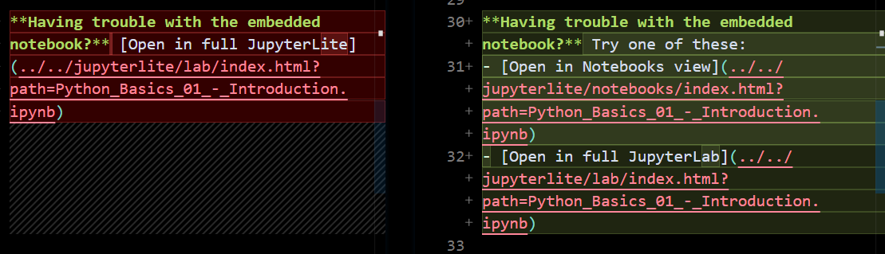
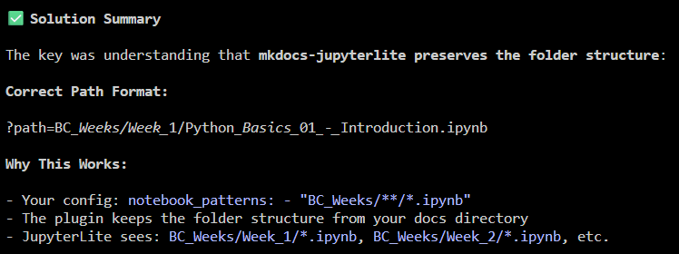

# Lessons Learned: Jupyter Notebooks in MkDocs

This section documents lessons learned while converting the original v2 of this bootcamp (as of December 2025 where you had to download the files to interact with the lessons) to a mkdocs site that could integrate Jupyter notebooks & have people interactively utilize the files in their browser.

## Quick Summary

1. You need to have a markdown file that creates a wrapper to show a particular Jupyter notebook.







JupyterLite can be configured different ways:
- Files might be in the root working directory
- Files might be in a `/files/` subdirectory
- The path parameter might need URL encoding
- Different interfaces (lab vs notebooks) might handle paths differently

Had to hide certain things in CI file so it didn't try to run tests against things it shouldn't be.

when using strict forced to address an incorrect item in my nav bar ... when fixed is cut the built time by ~50% (10+ sec)

---

## The Core Challenge

When trying to integrate interactive Jupyter notebooks into MkDocs while maintaining the MkDocs navigation sidebar, you face a fundamental architectural challenge:

**JupyterLite is a complete web application** with its own navigation, menu bars, file browser, and interface. When you embed it in an iframe within MkDocs, you're embedding the entire application, which creates a "nested" appearance (MkDocs navigation + JupyterLite navigation).

---

## Available Approaches

### Approach 1: Embed JupyterLite in iframes ⚠️

**How it works**: Create markdown pages with iframes that load JupyterLite with specific notebooks.

**Pros**:
- MkDocs navigation remains visible
- Notebooks are interactive
- Users stay within your documentation site

**Cons**:
- Creates "nested" interface (two navigation systems visible)
- Path configuration can be tricky (404 errors)
- iframe limitations (security, sizing, scrolling)
- JupyterLite's full interface might be too cluttered

**Example**:
```markdown
<iframe
  src="../../jupyterlite/notebooks/index.html?path=Python_Basics_01.ipynb"
  width="100%"
  height="800px">
</iframe>
```

---

### Approach 2: Direct Links to JupyterLite ✅ Recommended for Interactive

**How it works**: Link directly to JupyterLite, opening it in the same tab or a new tab.

**Pros**:
- Clean interface (no nesting)
- Full JupyterLite functionality
- No iframe limitations
- Easier path management

**Cons**:
- Users leave the MkDocs site
- MkDocs navigation not visible in JupyterLite
- Need to navigate back manually (or use browser back button)

**Example**:
```markdown
**Interactive Lessons**:
1. <a href="../jupyterlite/lab/index.html?path=Python_Basics_01.ipynb" target="_blank" rel="noopener noreferrer">Introduction</a>
2. <a href="../jupyterlite/lab/index.html?path=Python_Basics_02.ipynb" target="_blank" rel="noopener noreferrer">Syntax & Basics</a>
```

Using HTML anchor tags with `target="_blank"`, links open in a new tab, making it easy to switch back to documentation.

---

### Approach 3: Static Rendering with mkdocs-jupyter ✅ Good for Read-Only

**How it works**: Use the `mkdocs-jupyter` plugin to render notebooks as static HTML pages within MkDocs.

**Pros**:
- Perfect MkDocs integration with navigation
- Fast page loads
- No "nested" interface issues
- SEO-friendly (static HTML)

**Cons**:
- **Not interactive** - users can't run code
- Notebooks are read-only
- Need `mkdocs-jupyter` plugin

**Setup**:

1. Add to `pyproject.toml`:
```toml
dependencies = [
    "mkdocs-jupyter>=0.25.1",
]
```

2. Enable in `mkdocs.yml`:
```yaml
plugins:
  - mkdocs-jupyter:
      include_source: True
      execute: False
      allow_errors: False
```

3. Add notebooks to navigation:
```yaml
nav:
  - Week 1:
    - Introduction: BC_Weeks/Week_1/Python_Basics_01.ipynb
```

---

### Approach 4: Hybrid Approach ✅ Best of Both Worlds

**How it works**: Combine static rendering (for reading) with links to interactive version (for coding).

**Pros**:
- Beautiful static display with MkDocs navigation
- Option to open interactive version when needed
- Best user experience

**Cons**:
- Requires both `mkdocs-jupyter` and `mkdocs-jupyterlite`
- Slightly more complex setup

**Example**:
```markdown
# Introduction to Python

<!-- Static rendered notebook appears here automatically -->

---

**Want to run this code interactively?**
<a href="../jupyterlite/lab/index.html?path=Python_Basics_01.ipynb" target="_blank" rel="noopener noreferrer">Open in JupyterLite</a>
```

---

## Comparison Table

| Approach | Interactive | MkDocs Nav | Clean UI | Setup Complexity |
|----------|------------|------------|----------|-----------------|
| Embedded iframe | ✅ Yes | ✅ Yes | ❌ Nested | 🟡 Medium |
| Direct links | ✅ Yes | ❌ No | ✅ Clean | 🟢 Easy |
| Static rendering | ❌ No | ✅ Yes | ✅ Clean | 🟢 Easy |
| Hybrid | ✅ Yes | ✅ Yes | ✅ Clean | 🟡 Medium |

---

## Recommendations by Use Case

### For Learning/Training Sites (Like This Boot Camp)
**Use: Hybrid Approach (#4)** or **Direct Links (#2)**
- Display notebooks statically for reading OR link directly
- Provide JupyterLite links for hands-on practice
- Best learning experience

### For Documentation Sites
**Use: Static Rendering (#3)**
- Focus on displaying examples
- Code execution not critical

### For Interactive Coding Tutorials
**Use: Direct Links (#2)**
- Full JupyterLite experience
- Open in new tabs
- Simple and effective

---

## Fixing the 404 Error

If you're getting 404 errors when trying to load notebooks, check:

### 1. Notebook Path in JupyterLite

Notebooks are copied to `docs/jupyterlite/files/` during build. Check if your notebook is there:
```bash
ls docs/jupyterlite/files/*.ipynb
```

### 2. URL Path Parameter

The `path` parameter should reference just the notebook filename:

✅ **Correct**:
```
../jupyterlite/lab/index.html?path=Python_Basics_01.ipynb
```

❌ **Incorrect**:
```
../jupyterlite/lab/index.html?path=/files/Python_Basics_01.ipynb
../jupyterlite/lab/index.html?path=BC_Weeks/Week_1/Python_Basics_01.ipynb
```

### 3. Relative Path from Your Markdown File

If your markdown is at `docs/BC_Weeks/Week_1/lesson.md`, the path to JupyterLite is:
```
../../jupyterlite/lab/index.html
```

### 4. Ensure JupyterLite is Built

Make sure JupyterLite is built with your notebooks:
```bash
uv run mkdocs build
# or
uv run mkdocs serve
```

Check that `mkdocs.yml` has the jupyterlite plugin enabled with correct patterns:
```yaml
plugins:
  - jupyterlite:
      enabled: true
      notebook_patterns:
        - "BC_Weeks/**/*.ipynb"
```

---

## Available JupyterLite Interfaces

Your JupyterLite build includes multiple interfaces:

| Interface | URL | Use Case |
|-----------|-----|----------|
| **Lab** | `/jupyterlite/lab/` | Full JupyterLab with file browser, terminal, etc. |
| **Notebooks** | `/jupyterlite/notebooks/` | Simplified notebook-only interface |
| **Tree** | `/jupyterlite/tree/` | File browser view |
| **REPL** | `/jupyterlite/repl/` | Python console only |

For embedding, try `/notebooks/` instead of `/lab/` - it's simpler and less cluttered.

---

## FAQ

**Q: Can I hide JupyterLite's navigation when embedded?**
A: Not easily. JupyterLite is a full app and its UI is integral to its functionality.

**Q: Why not just use mkdocs-jupyter and make everything static?**
A: You can! It's simpler and provides better MkDocs integration, but notebooks won't be interactive.

**Q: Can users' work be saved when using JupyterLite?**
A: Yes, JupyterLite saves to browser local storage. Work persists across sessions (unless browser data is cleared).

**Q: Which interface should I use for embedding?**
A: Try `/notebooks/` first - it's simpler than `/lab/`. But direct links (no embedding) might be cleaner.

**Q: How do I reset notebooks to their original state?**
A: Users need to clear browser localStorage/IndexedDB for your site, or use JupyterLite's file menu to reset individual notebooks.

---

## Next Steps

1. Visit the [Test Embedding page](test-embedding.md) to see different approaches in action
2. Choose the approach that best fits your needs
3. Update your Week index pages accordingly