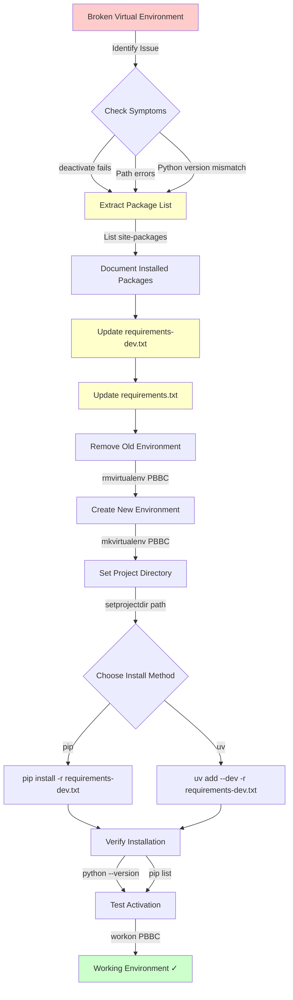

# Recreating Virtual Environments on Windows

## Overview

This tutorial explains how to recreate a Python virtual environment when the original Python installation no longer exists or has been
moved. This is a common scenario when:

- You've upgraded or reinstalled Python
- Your virtual environment references an old Python version that's been uninstalled
- Your environment files have been moved to a different location
- The `deactivate` command doesn't work in virtualenvwrapper-win

## Problem Symptoms

You may encounter these issues:

1. **Cannot deactivate environment**: The `deactivate` command is not recognized
2. **Path errors**: "The system cannot find the path specified" when using `setprojectdir`
3. **Missing Python**: Virtual environment points to a Python installation that no longer exists (e.g., `C:\Program Files\Python\Python310` but you now have Python 3.14)

## Why This Happens

Virtual environments are **not portable**. They contain:

- Hard-coded paths to the Python interpreter
- Binary executables compiled for a specific Python version
- Configuration files (`pyvenv.cfg`, `.project`) with absolute paths

When the underlying Python installation is removed or moved, these paths become invalid and the virtual environment breaks.

## Understanding virtualenvwrapper-win

### Key Files

- **`pyvenv.cfg`**: Contains paths to the base Python installation
- **`.project`**: Contains the path to your project directory
- **`WORKON_HOME` environment variable**: Points to where all virtual environments are stored (e.g., `D:\Programming\Envs`)

### Why `deactivate` Doesn't Work

With virtualenvwrapper-win, the `deactivate` command comes from the virtual environment's activation script. If the environment is
broken (pointing to non-existent Python), the activation script may not properly set up the `deactivate` command.

## Solution: Extract and Recreate

### Step 1: Extract Installed Packages

Before deleting the old environment, extract the list of installed packages.

```bash
# Navigate to the virtual environment's site-packages directory
ls "D:/Programming/Envs/PBBC/Lib/site-packages"

# Extract package names and versions
find "D:/Programming/Envs/PBBC/Lib/site-packages" -name "*.dist-info" -type d | sed 's/.*\///' | sed 's/\.dist-info$//' | sort
```

Example output:

```text
atomicwrites-1.4.1
attrs-22.2.0
colorama-0.4.6
coverage-7.1.0
pytest-6.2.5
pytest-cov-4.0.0
```

Step 2: Update Requirements Files

Create or update your `requirements-dev.txt` with the extracted packages. Example file contents:

```text
# ABOUTME: Development and testing dependencies for the Basics Boot Camp project
# ABOUTME: Install with pip: pip install -r requirements-dev.txt
# ABOUTME: Install with uv: uv add --dev -r requirements-dev.txt

# Testing Framework
pytest==6.2.5
pytest-cov==4.0.0
pytest-flakes==4.0.5
pytest-pep8==1.0.6
pytest-cache==1.0
pytest-pythonpath==0.7.4

# Code Quality Tools
coverage==7.1.0
pyflakes==3.0.1
pep8==1.7.1
```

Step 3: Remove Old Environment

```bash
# List all virtual environments
workon

# Remove the broken environment
rmvirtualenv PBBC
```

Step 4: Create New Environment

Using virtualenvwrapper-win:

```bash
# Create new environment (uses your current default Python)
mkvirtualenv PBBC

# Set the project directory
setprojectdir D:\Programming\Code\Basics-Boot-Camp
```

Step 5: Install Dependencies

Using pip:

```bash
# Activate the environment
workon PBBC

# Install development dependencies
pip install -r requirements-dev.txt

# Install production dependencies (if any)
pip install -r requirements.txt
```

Using uv (faster alternative):

```bash
# Activate the environment
workon PBBC

# Install development dependencies
uv add --dev -r requirements-dev.txt

# Install production dependencies (if any)
uv add -r requirements.txt
```

Step 6: Verify Setup

```bash
# Check Python version
python --version

# List installed packages
pip list

# Verify you can deactivate
# (Just open a new terminal without activating - fresh start confirms setup)
```

Best Practices

1. Always Maintain Requirements Files

Keep your `requirements.txt` and `requirements-dev.txt` files up to date:

```bash
# Generate/update requirements from current environment
pip freeze > requirements-dev.txt
```

2. Document Python Version

Add a `.python-version` file or note in your README:

```
3.14.0
```

3. Use Version Control

Commit your requirements files:

```bash
git add requirements.txt requirements-dev.txt
git commit -m "Add/update requirements files"
```

4. Verify WORKON_HOME

Ensure the `WORKON_HOME` environment variable is set correctly:

Windows (PowerShell as Administrator):

```powershell
setx WORKON_HOME "D:\Programming\Envs"
```

Check current value (cmd.exe):

```cmd
echo %WORKON_HOME%
```

Alternative: Using uv for Environment Management

`uv` is a modern, fast Python package manager that can also manage virtual environments:

```bash
# Create virtual environment with uv
uv venv

# Activate (on Windows)
.venv\Scripts\activate

# Install dependencies
uv add --dev -r requirements-dev.txt
uv add -r requirements.txt
```

Troubleshooting

Issue: "The system cannot find the path specified"

Cause: Old paths in `.project` file or environment variables

Solution:
1. Delete and recreate the virtual environment
2. Verify `WORKON_HOME` points to the correct location
3. Use `setprojectdir` to set the correct project path

Issue: `workon` lists environments but can't activate them

Cause: Virtual environments exist but point to non-existent Python installations

Solution: Remove and recreate affected environments

Issue: Packages missing after recreation

Cause: Requirements files not up to date

Solution: Before deleting old environment, extract package list (see Step 1)

Visual Overview

Text Description

The recreation process follows these steps:
1. Extract installed packages from the broken environment
2. Update requirements files with the extracted package list
3. Remove the broken virtual environment
4. Create a new virtual environment with the current Python version
5. Install all dependencies from the requirements files
6. Verify setup and confirm deactivation works properly

ASCII Diagram

```
┌─────────────────────────────────────────────────────────────────────┐
│             Virtual Environment Recreation Process                  │
└─────────────────────────────────────────────────────────────────────┘

OLD ENVIRONMENT (BROKEN)              NEW ENVIRONMENT (WORKING)
┌──────────────────────┐              ┌──────────────────────┐
│ PBBC                 │              │ PBBC                 │
│ ┌──────────────────┐ │              │ ┌──────────────────┐ │
│ │ Python 3.10 ✗    │ │   Extract    │ │ Python 3.14 ✓    │ │
│ │ (Missing)        │ │ ──packages─> │ │ (Current)        │ │
│ └──────────────────┘ │              │ └──────────────────┘ │
│                      │              │                      │
│ Installed Packages:  │              │ Installed Packages:  │
│ • pytest==6.2.5      │              │ • pytest==6.2.5      │
│ • coverage==7.1.0    │              │ • coverage==7.1.0    │
│ • pyflakes==3.0.1    │              │ • pyflakes==3.0.1    │
│ • ...                │              │ • ...                │
└──────────────────────┘              └──────────────────────┘
```

STEP-BY-STEP WORKFLOW:

```
┌─────────────┐     ┌─────────────┐     ┌─────────────┐     ┌─────────────┐
│    STEP 1   │     │    STEP 2   │     │    STEP 3   │     │    STEP 4   │
│             │     │             │     │             │     │             │
│   Extract   │────>│   Update    │────>│   Remove    │────>│   Create    │
│  Packages   │     │Requirements │     │    Old      │     │    New      │
│   from      │     │   Files     │     │Environment  │     │Environment  │
│site-packages│     │             │     │             │     │             │
└─────────────┘     └─────────────┘     └─────────────┘     └─────────────┘
```

Commands at each step:

- Step 1: `find "D:/Programming/Envs/PBBC/Lib/site-packages" -name "*.dist-info"`
- Step 2: Edit `requirements-dev.txt` with package list
- Step 3: `rmvirtualenv PBBC`
- Step 4: `mkvirtualenv PBBC`
- Step 5: `setprojectdir PATH:\to\code\repo`
- Step 6: `pip install -r requirements-dev.txt`  OR  `uv add --dev -r requirements-dev.txt`
- Step 7: `workon PBBC` → verify everything works

Mermaid Diagram



References

- https://github.com/davidmarble/virtualenvwrapper-win
- https://docs.python.org/3/library/venv.html
- https://github.com/astral-sh/uv
